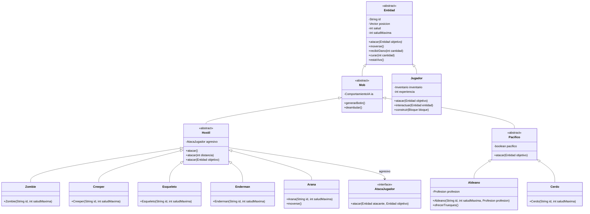

# sb-taller-git-2026

Servicio Spring Boot (Java 21, Maven, Spring Web) con un modelo de dominio
de Minecraft en `domain/` y los controllers REST en `rest/controller/`.

## Diagrama de clases

`atacar(Entidad objetivo)*` está marcado con `*` porque es abstracto: `Entidad`
lo declara pero no lo implementa, así que la clase queda incompleta y no se
puede instanciar. `Hostil` además usa `AtacaJugador` como estrategia de
ataque; cada subclase concreta le inyecta su propia lambda en el constructor
(`setAgresivo(...)`), por eso la interfaz aparece como dependencia y no como
superclase.

## Sobrecarga y sobreescritura

Son dos conceptos distintos que suelen confundirse. **Sobrecarga** significa
que una misma clase declara varios métodos con el **mismo nombre** pero
**distinta lista de parámetros**. **Sobreescritura** significa que una clase
hija redefine un método que ya existía en su superclase, con **exactamente la
misma firma**.

### Sobrecarga (dentro de una misma clase)

Los constructores de `Jugador` son el ejemplo más claro. Hay cinco firmas
distintas del mismo constructor:

| Firma | Qué aporta |
| --- | --- |
| `Jugador()` | Todo por defecto: id `"Steve"`, 20 de salud, 0 de experiencia, en el origen del mundo. |
| `Jugador(String id)` | Solo el id; la salud, la experiencia y la posición siguen por defecto. |
| `Jugador(String id, int saludMaxima)` | Id y salud; experiencia y posición por defecto. |
| `Jugador(String id, int saludMaxima, int experiencia)` | Id, salud y experiencia; posición por defecto. |
| `Jugador(String id, int saludMaxima, int experiencia, Vector posicion)` | Todo configurable. Valida los datos y deja al objeto en estado válido. |

Todas las firmas menos la última encadenan con `this(...)` hacia la más
completa, así que la validación y la asignación de campos viven en un único
lugar y no se repiten. `Jugador` es sobrecarga y no sobreescritura porque
ninguna de estas firmas viene de una superclase: `Entidad` no declara ningún
constructor `Jugador(...)`, la jerarquía no participa. Si mañana existiera un
`Jugador` con otra firma en la clase padre, ahí sí habría una relación
distinta.

El otro caso es `Hostil`, que ofrece tres sobrecargas de `atacar`:

- `atacar()` no recibe datos: el hostil dispara a ciegas y delega en
  `atacar(ALCANCE_MAXIMO)`.
- `atacar(int distancia)` recibe la distancia al objetivo: solo impacta si
  está dentro de su alcance máximo, y rechaza distancias negativas con
  `IllegalArgumentException`.
- `atacar(Entidad objetivo)` recibe a quién atacar y ejecuta la estrategia
  `agresivo`.

Las tres conviven en `Hostil` con el mismo nombre y distinto número de
parámetros, y Java resuelve en tiempo de compilación cuál llamar mirando los
argumentos que se pasan.

### Sobreescritura (entre una hija y su superclase)

`Entidad` declara `public abstract void atacar(Entidad objetivo)`. Es el
comportamiento común a toda la jerarquía, pero cada rama lo resuelve a su
modo, así que la base no lo implementa. Las tres hijas directas lo
sobreescriben con la **misma firma**, `atacar(Entidad objetivo)`:

- `Hostil` delega en su estrategia `AtacaJugador`, la lambda que cada
  subclase concreta inyectó en el constructor. Un `Zombie` pega 5 de daño, un
  `Creeper` 20, un `Esqueleto` 4, un `Enderman` 7 y un `Arana` 3.
- `Pacifico` se niega a atacar e informa que es pacífico, sin hacer daño.
- `Jugador` golpea con la mano y aplica 4 de daño.

Todas llevan `@Override`, que no es obligatorio en Java pero hace que el
compilador falle si la firma deja de coincidir con la de la superclase.

`Zombie`, `Creeper`, `Esqueleto` y `Enderman` no sobreescriben `atacar`: la
heredan de `Hostil`. Lo que cada una hace es configurar distinto la estrategia
`agresivo` que su padre ejecuta. Lo mismo pasa con `Aldeano` y `Cerdo`, que
heredan la implementación de `Pacifico`.

`Arana` sí sobreescribe otro método: `moverse()`, que en `Entidad` es
concreto e imprime un mensaje genérico. `Arana` lo redefine para imprimir que
trepa por una superficie. Sirve para recordar que sobreescribir no es
exclusivo de los métodos abstractos: cualquier método heredado se puede
redefinir, siempre que la firma se mantenga igual.

La sobreescritura se resuelve en tiempo de ejecución y por eso el controller
puede juntar clases distintas sin preguntar por el tipo. En
`MobController`, el endpoint `GET /mobs/ataque` guarda los mobs en una lista
de tipo `Entidad` y les llama a `atacar(objetivo)` a todos por igual: cada
objeto ejecuta su propia versión. No hay un solo `if` ni `switch` por tipo,
porque la decisión está en el modelo, no en el controller.

En resumen: la sobrecarga responde *"qué datos necesita mi método para
funcionar"* y se decide al compilar dentro de una misma clase; la
sobreescritura responde *"qué hace cada tipo de entidad cuando todos
comparten el mismo mensaje"* y se decide al ejecutar, entre clases
relacionadas por herencia.
